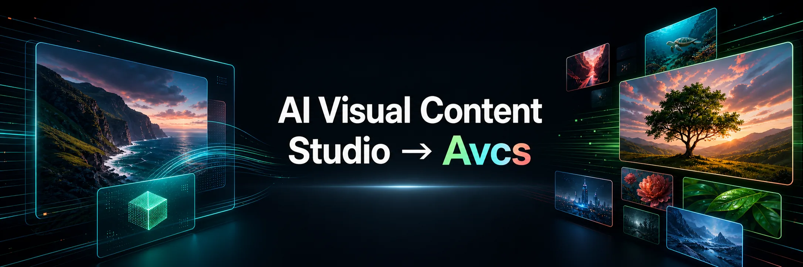
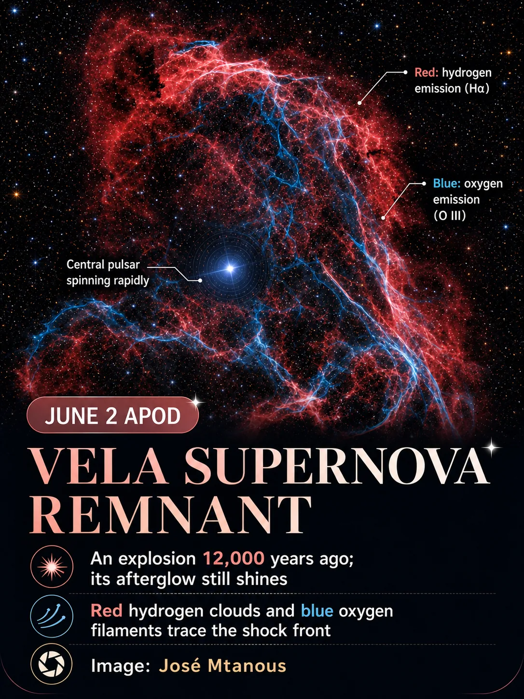
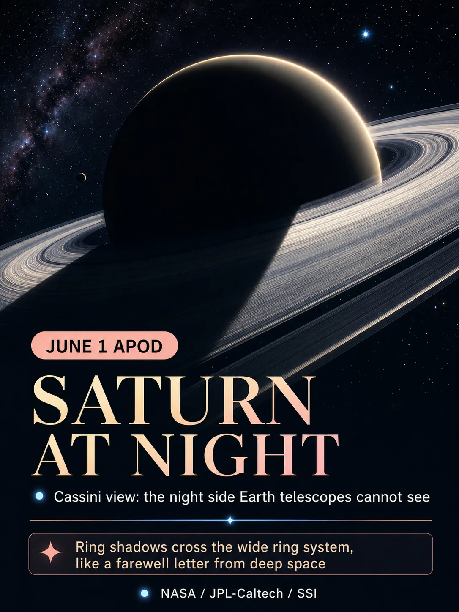
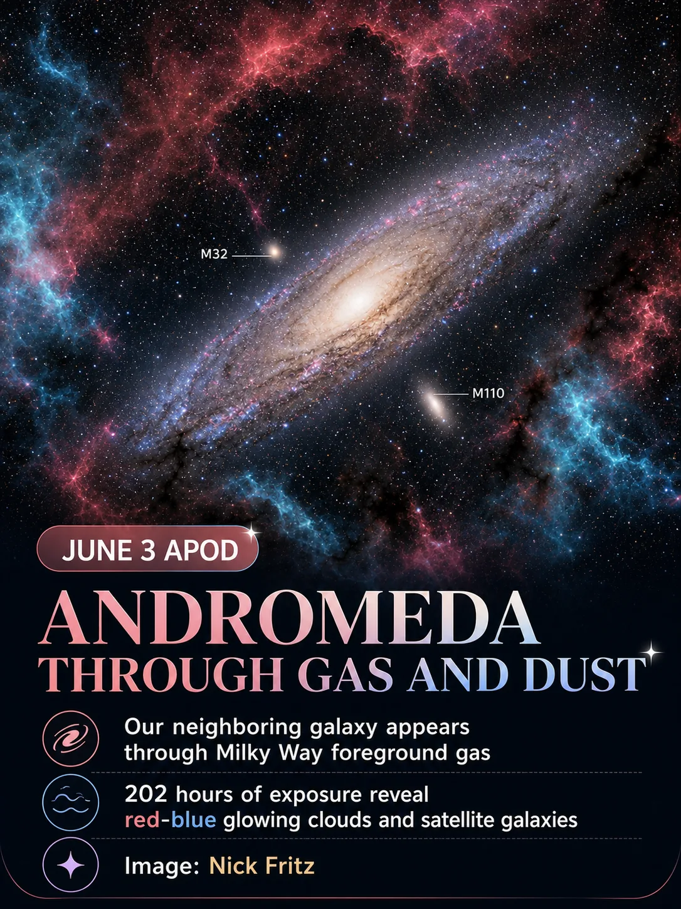
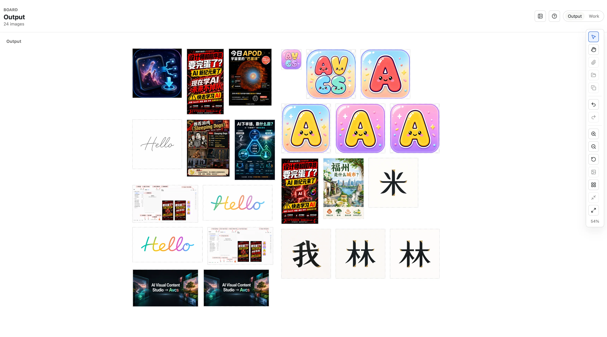

# Avcs

AI Visual Content Studio → Avcs



<p align="center"><b>English</b> · <a href="docs/i18n/README.zh-CN.md">简体中文</a></p>

## Summary

Avcs is a local-first visual content studio. It can use Codex Agent through
`codex app-server`, or AvcsAgent through Vercel AI Gateway when Codex is not
available.

## Requirements

- Install [Codex CLI](https://developers.openai.com/codex/cli) to use the Codex Agent harness.
- Configure a Vercel AI Gateway API key in `/web/settings` to use the AvcsAgent harness.

## Usage


## Architecture

Avcs is a local-first web app. Elixir/Phoenix is the single local backend
boundary for state, files, SQLite, and Agent access; the React frontend never
reads the local filesystem, SQLite, `codex app-server`, or Vercel AI Gateway
directly. Desktop packaging can use a Tauri shell with an ElixirKit-style bridge
to start Phoenix and open the web UI.

```text
┌────────────────────────── browser / Tauri shell ───────────────────────────┐
│ system tray + local-port web app in browser                                │
└──────────────────────────────────────┬─────────────────────────────────────┘
                                       │
                                       ▼
┌────────────────────────── Elixir/Phoenix + React ──────────────────────────┐
│ UI, WebSocket channels, HTTP APIs, app boundary                            │
└──────────────────────────┬───────────────────────────────────────┬─────────┘
                           │                Agent Harness          │
                           ▼                                       ▼
┌────────────────────────────────────────────────────┐  ┌────────────────────┐
│ SQLite                                             │  │ Codex Agent        │
└────────────┬───────────────────────────┬───────────┘  │ or AvcsAgent       │
             │                           │              └──────────┬─────────┘
             ▼                           ▼                         ▼
┌────────────────────────┐  ┌────────────────────────┐  ┌────────────────────┐
│ global DB              │  │ project DB + files     │  │ image generation   │
│ ~/.avcs/avcs.sqlite3   │  │ .avcs/project.sqlite3  │  │ tool events        │
│ settings + secrets     │  │ work/, output/         │  │ text streaming     │
└────────────────────────┘  └────────────────────────┘  └────────────────────┘
```

The `/web/settings` page controls the global harness mode:
`codex`, `auto`, or `avcs_agent`. The default is `codex`. `auto` prefers Codex
and falls back to AvcsAgent when Codex is unavailable and the gateway key is
configured.

Codex Agent uses Codex built-in `image_gen`. AvcsAgent uses the Avcs backend
`image_gen` tool, which writes generated files to the current project
`output/` directory and then records assets, chat items, and board items through
Phoenix.


## Why Avcs

Avcs started from three practical needs.

First, when I ran out of credits on Lovart, I realized I already had a ChatGPT Pro
subscription. I did not want to pay for another dedicated image generation
subscription on top of that, so Avcs is built around `codex app-server` as a
local-first visual content studio.

Second, image generation often depends on accurate reference assets, not just
prompts. If I want to create a poster for a specific Steam game, for example, I
need the correct cover image available in the workflow. Avcs includes data
provider support so projects can quickly load precise image assets from external
sources and use them as references.

Third, local-first workflows can interact with the real contents of my local
project folders. I can ask Avcs to read and understand the code in a project,
then annotate a screenshot with button explanations or other inline help
documentation that stays close to the project files it describes.


## Demo

### 1. NASA APOD Poster

Avcs can load external visual references directly from the composer. Click the
book-shaped icon in the lower-left corner, load the NASA APOD data provider, and
ask Codex to generate a poster for the Astronomy Picture of the Day from a chosen
month and day.

<table>
  <tr>
    <th>Open Data Providers</th>
    <th>Load NASA APOD</th>
    <th>Generate the Poster</th>
  </tr>
  <tr>
    <td></td>
    <td></td>
    <td></td>
  </tr>
</table>

### 2. Many-Case Output Board

Avcs keeps generated and imported visuals on a freeform Output board. A project
can collect poster drafts, icon explorations, typography tests, annotated
screenshots, and banner variants in one workspace, then select any image for
preview or reuse as a reference in the next Agent turn.


