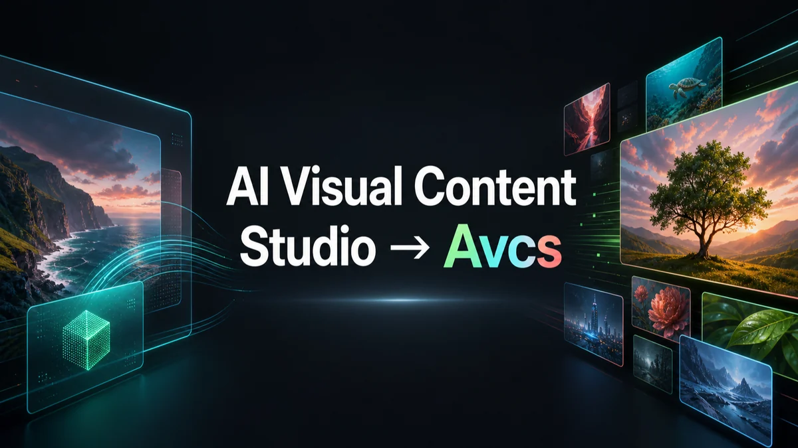

# Avcs

<p align="center"><a href="../../README.md">English</a> · <b>简体中文</b></p>

AI Visual Content Studio → Avcs



## 概览

Avcs 是一个使用 Codex 生成图片的工作室工具。

## 运行要求

- 安装 [Codex CLI](https://developers.openai.com/codex/cli)（用于启动 `codex app-server` 并运行本地 Agent 工作流）。

## 使用方式


## 架构

Avcs 是一个 local-first Web 应用。Elixir/Phoenix 是唯一的本地后端边界，
负责状态、文件、SQLite 和 Codex Agent 访问；React 前端不会直接读取本地
文件系统、SQLite 或 `codex app-server`。桌面打包可以使用 Tauri 外壳，并
通过类似 ElixirKit 的桥接方式启动 Phoenix 和打开 Web UI。

```text
┌────────────────────────── browser / Tauri shell ───────────────────────────┐
│ system tray + local-port web app in browser                                │
└──────────────────────────────────────┬─────────────────────────────────────┘
                                       │
                                       ▼
┌────────────────────────── Elixir/Phoenix + React ──────────────────────────┐
│ UI, WebSocket channels, HTTP APIs, app boundary                            │
└──────────────────────────┬───────────────────────────────────────┬─────────┘
                           │                 stdio:// JSONL        │
                           ▼                                       ▼
┌────────────────────────────────────────────────────┐  ┌────────────────────┐
│ SQLite                                             │  │ codex app-server   │
└────────────┬───────────────────────────┬───────────┘  └──────────┬─────────┘
             │                           │                         │
             ▼                           ▼                         ▼
┌────────────────────────┐  ┌────────────────────────┐  ┌────────────────────┐
│ global DB              │  │ project DB + files     │  │ Codex Agent        │
│ ~/.avcs/avcs.sqlite3   │  │ .avcs/project.sqlite3  │  │ image_gen          │
│                        │  │ work/, output/         │  │ tool events        │
└────────────────────────┘  └────────────────────────┘  └────────────────────┘
```


## 为什么做 Avcs

Avcs 来自三个实际需求。

第一，当我在 Lovart 上用完额度时，我意识到自己已经有 ChatGPT Pro 订阅。
我不想在已有订阅之外再为专门的图片生成工具付费，所以 Avcs 围绕
`codex app-server` 构建成一个 local-first 的视觉内容工作室。

第二，图片生成经常依赖准确的参考素材，而不只是提示词。比如我想为某个
Steam 游戏制作海报，就需要把正确的封面图放进工作流。Avcs 包含数据提供
方支持，让项目可以快速从外部来源加载准确的图片素材，并把它们作为参考。

第三，local-first 工作流可以和本地项目文件夹中的真实内容交互。我可以让
Avcs 读取并理解某个项目中的代码，然后在截图上添加按钮说明或其他内联帮助
文档，并让这些文档和它们描述的项目文件保持在一起。


## Demo

### 1. NASA APOD 海报

Avcs 可以直接从输入区加载外部视觉参考。点击左下角的书本图标，加载 NASA
APOD 数据提供方，然后让 Codex 为选定月份和日期的 Astronomy Picture of the
Day 生成一张海报。

<table>
  <tr>
    <th>打开数据提供方</th>
    <th>加载 NASA APOD</th>
    <th>生成海报</th>
  </tr>
  <tr>
    <td></td>
    <td></td>
    <td></td>
  </tr>
</table>

### 2. 多案例 Output 画板

Avcs 会把生成和导入的视觉内容保留在自由布局的 Output 画板上。一个项目可以
在同一个工作区收集海报草稿、图标探索、字体测试、标注截图和 banner 变体，
然后选择任意图片预览，或在下一轮 Codex 对话中继续作为参考使用。


